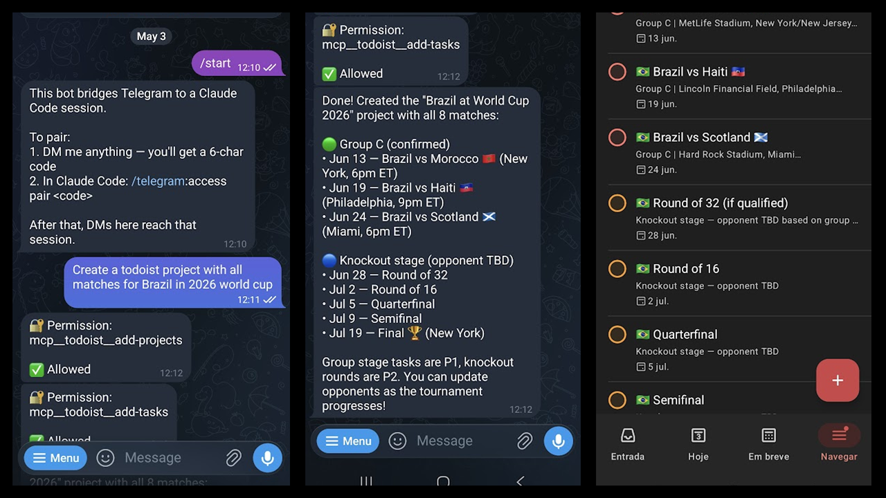

# claude-clovis

Clovis is a persistent AI agent built on [Claude Code](https://claude.ai/code), reachable via Telegram. It runs as a Docker container and operates on a dedicated git workspace.



## Motivation

This project started as an exploration of [openclaw.ai](https://openclaw.ai/) — a cloud-based AI assistant that connects to your email, calendar, todos, and messages. The idea was compelling, but the security implications were not: you are handing a third-party service full access to your Gmail, WhatsApp, and the rest of your personal data, with no real visibility into what it does with it.

The internet has also produced some memorable reminders of what happens when an agent has write access to everything and acts on ambiguous instructions — [like texting your ex](https://www.reddit.com/r/ChatGPT/comments/1sng426/my_openclaw_texted_my_ex/).

Clovis is the alternative: the same concept, but self-hosted, small, and built on Claude Code. You own the container, the credentials never leave your machine, and everything the agent does is visible in git history.

**What it is today:** a Docker wrapper around Claude Code that lets you run a persistent agent reachable via Telegram, using your existing Claude subscription — no API key, no extra cost on top of what you already pay.

**Where it's going:**

- **Easy, reproducible setup** — copy `docker-compose.yml`, fill in `.env`, and have a working agent in minutes ✓
- **MCP tool integrations** — Gmail, Todoist, WhatsApp, Google Calendar, and others will be added incrementally as MCP servers
- **Granular access control** — each MCP tool restricted to read-only by default, so the agent can read your emails without being able to send them, read your calendar without creating events. You decide what it can touch.

> **Compliance note:** Clovis is designed for personal use. If you are considering using it in a work context, your organization may have data governance policies, corporate IT requirements, or regulatory obligations (GDPR, HIPAA, SOC 2, etc.) that govern what tools can access company data. Evaluate accordingly — personal and professional contexts carry very different rules.

## Concept

An agent instance is made of two repos:

```
claude-clovis       ← the shell: container, auth, Telegram, config
clovis-workspace    ← the workspace: git repo Clovis reads and writes
```

**`claude-clovis`** (this repo) is the environment — it defines how the agent runs, how it authenticates, and how it connects to Telegram. You manage this from the host.

**`clovis-workspace`** is where Clovis does its work — a regular git repo mounted into the container at `/workspace`. Clovis can read files, write code, make commits, and push. You review what it did via git history.

This separation keeps infra concerns out of the workspace and gives Clovis a clean, auditable place to operate.

## How it works

The container installs Claude Code and starts it with the `--channels` flag, loading the official Telegram plugin (`plugin:telegram@claude-plugins-official`). [Bun](https://bun.sh) is required by the channels MCP server and is installed system-wide. [tini](https://github.com/krallin/tini) is used as PID 1 to reap zombie processes that Bun spawns.

> **Note:** The Telegram channels feature requires a compatible Claude plan (Pro, Max, Team, or Enterprise).

## Setup

### 1. Create a working directory

```bash
mkdir clovis && cd clovis
```

### 2. Get `docker-compose.yml`

Download it from this repo:

```bash
curl -fsSL https://raw.githubusercontent.com/thiagob/claude-clovis/main/docker-compose.yml -o docker-compose.yml
```

### 3. Create the data layout

```bash
mkdir -p data/config data/workspace
touch data/claude.json
sudo chown -R 1001:1001 data/
```

`data/claude.json` must be created as a file before the first run — Docker would otherwise create it as a directory, which breaks Claude Code.

### 4. Set up the workspace

To start fresh:

```bash
git -C data/workspace init
```

Or if you have an existing repo, clone it instead:

```bash
git clone https://github.com/<your-username>/clovis-workspace.git data/workspace
```

### 5. Create `.env`

```env
BOT_NAME=clovis
CLAUDE_CODE_OAUTH_TOKEN="your-claude-oauth-token"
TELEGRAM_BOT_TOKEN="your-telegram-bot-token"
```

Create a bot and get its token from [@BotFather](https://t.me/BotFather) on Telegram (`/newbot`).

To get a long-lived OAuth token, run on a machine where you are already logged into Claude Code:

```bash
claude setup-token
```

> Always wrap `CLAUDE_CODE_OAUTH_TOKEN` in double quotes — the token may contain a `#` which `.env` parsers treat as a comment delimiter, silently truncating the value.

### 6. First-time wizard

```bash
docker compose run --rm agent
```

On first start Claude Code will:
1. Warn that `.claude.json` contains invalid JSON — choose **Reset with default configuration**
2. Ask you to select a login method — choose **Claude account with subscription**
3. Show a URL to complete OAuth in your browser
4. Show a theme/onboarding wizard — complete it fully before exiting

Once inside, install the Telegram plugin:

```
/plugin install telegram@claude-plugins-official
```

> If you set `TELEGRAM_BOT_TOKEN` in `.env`, the plugin picks it up automatically and no further configuration is needed. If you skipped that env var, run `/telegram:configure <your-botfather-token>` before exiting.

Exit with Ctrl+C.

### 7. Pair your Telegram account and lock down access

Open Telegram and send any message to your bot. It will reply with a pairing code.

Attach to the running container and open a Claude Code session:

```bash
docker compose run --rm agent
```

Once inside the Claude Code prompt (not your bash shell), run:

```
/telegram:access pair <code>
/telegram:access policy allowlist
```

The allowlist is critical: without it, anyone who finds your bot's username can send it messages and interact with your agent. Once enabled, only paired accounts are allowed — everyone else is silently dropped.

See the [official channels documentation](https://code.claude.com/docs/en/channels#security) for full details on how the sender allowlist works.

Exit with Ctrl+C. All state is saved to `./data/` and persists across restarts.

### 8. Run in the background

```bash
docker compose up -d
```

Open Telegram and message your bot. Clovis will respond as if you were using Claude Code in a terminal, with full access to the workspace repo.

## Development

To modify the container itself, clone the repo and use `setup.sh` to automate steps 3 and 5 above:

### 1. Clone this repo

```bash
git clone https://github.com/thiagob/claude-clovis.git
cd claude-clovis
```

### 2. Run setup

```bash
./setup.sh
```

The script prompts for bot name and Telegram token, creates the data layout, sets ownership to UID 1001, and scaffolds `.env`. Then continue from step 4 (set up the workspace) and fill in the remaining `.env` values.

## Configuration

| Variable | Required | Description |
|---|---|---|
| `BOT_NAME` | Yes | Agent name — sets the Docker container name to `claude-<name>` |
| `CLAUDE_CODE_OAUTH_TOKEN` | Yes | Long-lived auth token from `claude setup-token` |
| `TELEGRAM_BOT_TOKEN` | Yes | Bot token from @BotFather |
| `TZ` | No | Container timezone. Defaults to `America/Sao_Paulo` |

### Volumes

| Host path | Container path | Purpose |
|---|---|---|
| `./data/config` | `/home/claude/.claude` | OAuth tokens, Telegram pairing, sessions, plugins |
| `./data/claude.json` | `/home/claude/.claude.json` | Wizard state, theme preference |
| `./data/workspace` | `/workspace` | The workspace repo Clovis operates on |

> `./data/claude.json` must exist as a **file** before the first run — Docker creates missing bind-mount targets as directories, which breaks Claude Code. Step 3 above handles this with `touch`.

## Commands

```bash
docker compose run --rm agent   # interactive session (first-time wizard, pairing)
docker compose up -d            # start in background
docker compose logs -f          # follow logs
docker compose down             # stop (state preserved in ./data/)
```
